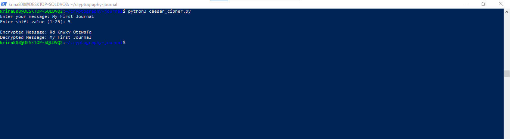

# Week 01 - Cryptography Journal

## Topic Overview
In the course of this week, I tackled the **Caesar Cipher**, one of the simplest and yet most popular branch of encryption techniques. The method shifts each plaintext letter a predetermined number of positions to lower alphabetical positions. This encryption method grants basic protection which seems insufficient compared to current security measures yet it supports fundamental concepts of historic cryptography systems.
## Insights and Reflections
While letter shifting did not seem like the most complex concept to grasp, I had a hard time figuring out how to implement this cipher in code. Writing a functionaly implementation will be possible using a similar algorithm, but by breaking the algorithm step by step and apply it to both the lowercase and the uppercase letters. Along with that I learnt the limitations of the Caesar Cipher, it is not immune to **Brute force attacks** there which means only 25 possible shifts.
## Code Implementation: nano caesar_cipher.py
Here is my implementation of the Caesar Cipher in Python:

def caesar_cipher(text, shift, encrypt=True):

    result = ""
    
    for char in text:
    
        if char.isalpha():
        
            shift_amount = shift if encrypt else -shift
            
            new_char = chr(((ord(char.lower()) - 97 + shift_amount) % 26) + 97)
            
            result += new_char.upper() if char.isupper() else new_char
            
        else:
        
            result += char
            
    return result

## Example Usage
plain_text = input("Enter your message: ")

shift_value = int(input("Enter shift value (1-25): "))

cipher_text = caesar_cipher(plain_text, shift_value)

print("Encrypted Message:", cipher_text)

print("Decrypted Message:", caesar_cipher(cipher_text, shift_value, encrypt=False))

## Code Output

Enter your message: My First Journal

Enter shift value (1-25): 5

Encrypted Message: Rd Knwxy Ozwsfqi

Decrypted Message: My First Journal

Screenshot: 

# Illustrating Attacks on Systems
Brute force attack is a common attack on systems that use the Caesar Cipher, where all 25 possible shift values are tried out to see if the correct one is encountered. This attack is so effective and easy to execute that there are only 25 potential shifts for this attack, and because Caeser cipher is much more believed to be insecure than it actually is. This shows how a simple encryption method like DES, which provides very small key space and small iterations, is easy to break by brute force attacks.

# Explanations of Difficulties
The Caesar Cipher was quite challenging because I did not know how to deal with uppercase and lowercase letters while still doing the proper shift behavior. Initially, I did not know how to apply the shifting operation to both cases properly as to preserve the case of the letters in the output. This problem was solved by breaking down the process to handling each case separately and modular arithmetic.

# Links to and Short Summaries of Websites/Papers/Software on Security Systems and Their Attacks

1. Introduction to Cryptography:

Link: https://www.tutorialspoint.com/cryptography/index.htm

In this website, you have good introduction to cryptography and different encryption methods, such as Caesar cipher and classical encryption, and quite modern encryption algorithms such as RSA and AES.

2. Cryptography and Network Security:

Link: https://www.amazon.com/Cryptography-Network-Security-Principles-Applications/dp/0134444280

Bill Stallings’ textbook on classical and modern cryptographic systems is a more or less required reading. Its great value allows you to dig into cryptography principles, algorithms and their usage in network security.

3. Brute Force Attack on Caesar Cipher:

Link: https://www.geeksforgeeks.org/caesar-cipher-in-cryptography/

In this GeeksforGeeks article, we explain the Caesar Cipher, its implementation and show its weakness: how it fails against brute force attacks, because of its small key space.
## Comparisons and Observations
The Caesar Cipher is incredibly insecure compared to modern ciphers such as AES or RSA. However, this is helpful in developing an understanding of notions such as substitution ciphers and modular arithmetic. However, its simplicity makes it suitable for educating (what encryption is really about) and perhaps for explaining how encryption works.
## Challenges and Solutions
Initially, since I tried to pass the empty value to int(), I got a ValueError. To resolve it, I enclosed it in a try – except and checked the type of entered value was an int before using the methods.

