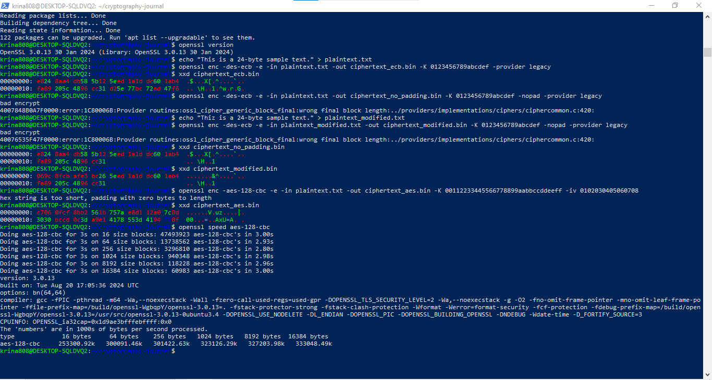

## Week 0 3 - Cryptography Journal

Algorithm: DES in ECB Mode

Objective: Encrypt plaintext using the Data Encryption Standard (DES) in Electronic Codebook (ECB) mode using OpenSSL.

Commands and Execution

# Check OpenSSL version

openssl version

# Create plaintext file

echo "This is a 24-byte sample text." > plaintext.txt

# Encrypt using DES in ECB mode

openssl enc -des-ecb -e -in plaintext.txt -out ciphertext_ecb.bin -K 0123456789abcdef -provider legacy

# View encrypted output using hexdump

xxd ciphertext_ecb.bin

Output:

e824 8aa4 db58 5b12 5eed 1a1d dc60 1ab4

fa89 205c 4896 cc31 d25e 77bc 72ad 47f6

Error Handling with No Padding

Attempted No Padding Encryption:

openssl enc -des-ecb -e -in plaintext.txt -out ciphertext_no_padding.bin -K 0123456789abcdef -nopad -provider legacy
Error:

bad encrypt

error:1C80006B:Provider routines:ossl_cipher_generic_block_final:wrong final block length

•	Reason: DES requires input in 8-byte blocks. Without padding, encryption fails if the input is not a multiple of 8 bytes.

Modified Plaintext Attempt

echo "Thiz is a 24-byte sample text." > plaintext_modified.txt

openssl enc -des-ecb -e -in plaintext_modified.txt -out ciphertext_modified.bin -K 0123456789abcdef -nopad -provider legacy

•	Still resulted in a block length error.

Algorithm: AES in CBC Mode

Objective: Encrypt plaintext using AES-128 in Cipher Block Chaining (CBC) mode.

Commands and Execution

# Encrypt using AES-128-CBC

openssl enc -aes-128-cbc -e -in plaintext.txt -out ciphertext_aes.bin \

-K 00112233445566778899aabbccddeeff -iv 0102030405060708

Output:

c706 0fcf 8bb2 561b 757a e8d1 12a0 7c8d

3030 bccd 0c3d a9e1 4178 553d 4194 ff8f

Performance Evaluation

openssl speed aes-128-cbc

Output:

Doing aes-128-cbc for 3s on 16 size blocks: 47493923 aes-128-cbc's in 3.00s

Doing aes-128-cbc for 3s on 64 size blocks: 13738562 aes-128-cbc's in 2.93s

Doing aes-128-cbc for 3s on 256 size blocks: 3296810 aes-128-cbc's in 2.80s

Doing aes-128-cbc for 3s on 1024 size blocks: 940348 aes-128-cbc's in 2.98s

## Insights and Reflections

AES in CBC mode is more secure and efficient compared to DES in ECB mode, as it introduces randomness using an Initialization Vector (IV) and prevents identical ciphertext for repeated plaintext. The padding issue observed in DES encryption highlights the importance of ensuring plaintext sizes are aligned with block sizes. Additionally, AES-128 demonstrated superior performance, making it a preferred choice for modern encryption needs.

Screenshot: 

