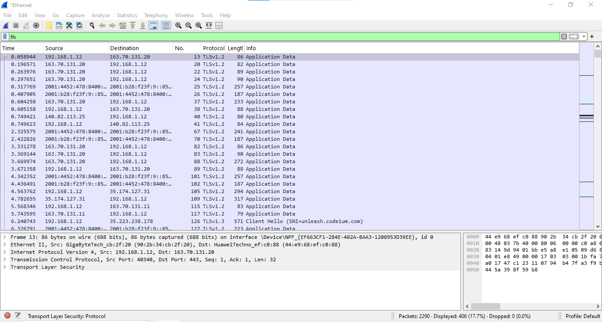
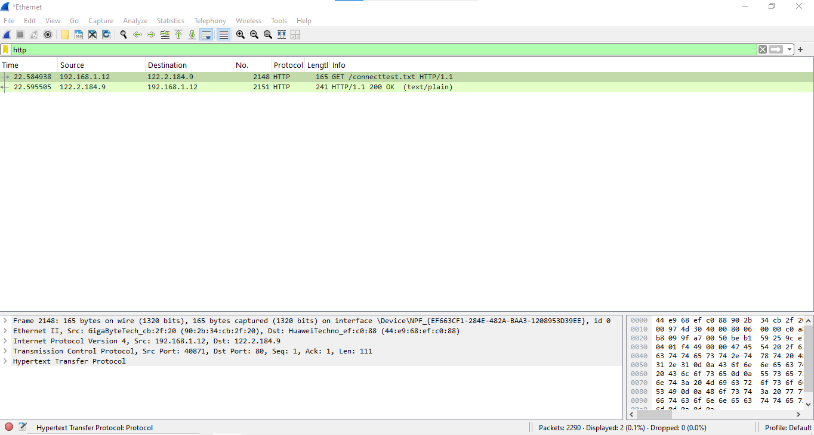
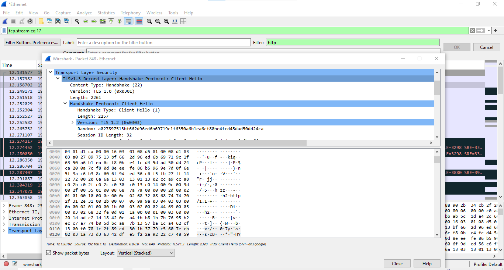
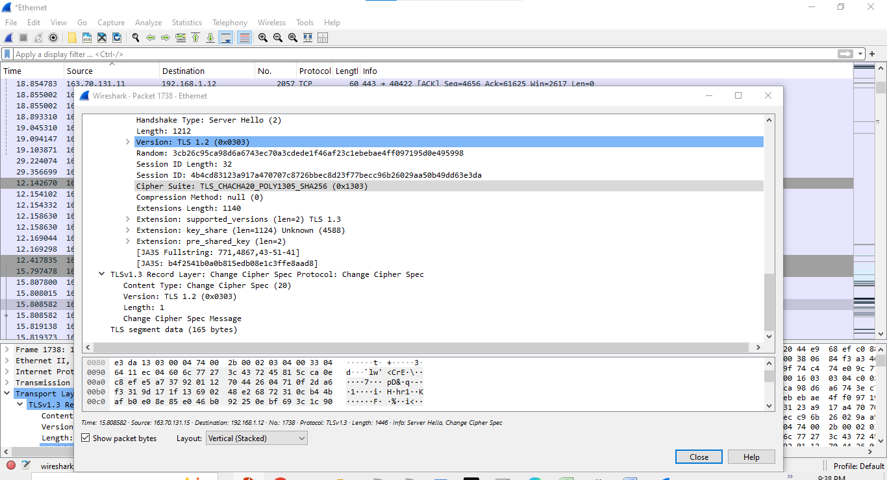
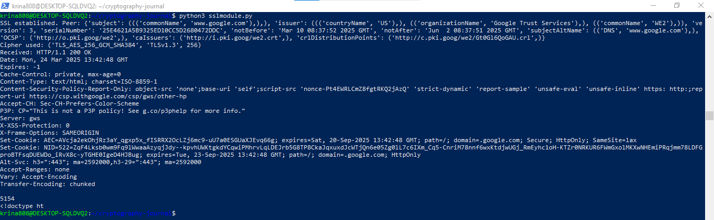

## Week 07 Journal Activity

## Algorithms Used in TLS Handshake
-With the Client Hello message, the client provides supported versions, cipher suites and requested compression methods that it is willing to use. It also includes a randomly generated number for secure key generation for the client.

-The Server Hello message is returned from the server, based on what it thinks will be the most secure options of that server given the client’s preferences. Next, it uses its digital certificate to send out its digital certificate for authentication to a trusted certificate authority (CA).

-After ensuring that the certificate of the server is valid, both parties invoke the key exchange. Depending on the algorithm they chosen, they produce a common secret using some method such as the Diffie-Hellman or RSA.

-To encrypt data, the session keys are derived from the shared secret by the client and server. After the handshake, symmetric encryption is started for secure data transfer over encrypted HTTP.

## Capturing HTTPS Traffic with Wireshark
# Filter Traffic for TLS & HTTP

# Inspect the TLS Handshake

The Client Hello message with the supported versions, cipher suites, and compression methods constitute the start of the TLS handshake. The client has a number also generated at random for secure key generation.

The server replies with the Server Hello message taking into account the list of most secure options offered by the client. It uses its digital certificate to send this to an entitled certificate authority (CA) that can verify its identity.Verifying the server’s certificate, both parties go on with the key exchange. For the selected algorithm they employ methods like Diffie Hellman or RSA and from there the create a shared secret.

## Python Code for Simulating TLS using SSL Library

running sslmodule.py: 

import socket

import ssl

host = 'www.google.com'

port = 443

context = ssl.create_default_context()

with socket.create_connection((host, port)) as sock:

    with context.wrap_socket(sock, server_hostname=host) as ssock:
    
        print("SSL established. Peer:", ssock.getpeercert())
        
        print("Cipher used:", ssock.cipher())
        
        ssock.sendall(b"GET / HTTP/1.1\r\nHost: www.google.com\r\n\r\n")
        
        data = ssock.recv(4096)
        
        print("Received:", data.decode('utf-8', errors='ignore')) ''''
        

The simulation illustrates the way in which the client and server exchange randomly and use asymmetric encryption to generate a shared secret. This ensures that the key exchange is secure, which in our case is for encrypted communication. With the server’s public key, the pre-master secret is encrypted and with its private key it is decrypted. In this, the importance of asymmetric encryption comes up in securing key generation in TLS.

# Illustrating Attacks on Systems
Man in the middle (MitM) attack is a common attack on cryptographic systems which allows an attacker to intercept communication taking place between two parties, hence the attacker can manipulate between both the parties. In TLS handshake, assuming the attacker can impersonate server, they can intercept and modify messages in transit to the intended recipient. Nevertheless, it can be thwarted by authenticating (digital) certificates properly, for example by means of public key pinning or through the usage of certificate authorities to ensure that the certificate is valid and harmless. If they both have security correct, properly verify their connection through certificates and finally, if that communication is properly encrypted, the attack does not work.

# Difficulties in Understanding Security Systems
It was difficult to understand the intricacies of cryptographic protocols, but particularly how symmetric and asymmetric encryption are used together. Especially, it becomes difficult to grasp how the public key infrastructure (PKI), as well as the certificate authorities (CAs), interact with the key exchange protocols, such as the Diffie-Hellman. However, it was a bit hard to see how the selected algorithm decides whether Diffie Hellman or RSA would go better for certain things, given challenges such as performance and availability of attacks like logjam or padding oracle.

# Links to and Summaries of Websites/Papers/Software on Security Systems and Their Attacks

Google Security Blog - RSA Key Exchange Vulnerability (Logjam Attack)

link: https://security.googleblog.com/2015/06/announcing-poodle-bug-bounty-and.html

This article talks about the Logjam attack, an attack upon weak groups of the Diffie-Hellman used in the key exchange process. Attacks would be able to force the server to use smaller, easier to compute prime numbers which would break the encryption. In fact, as Google points out, this vulnerability is something that can be avoided by using large, secure prime numbers in Diffie-Hellman key exchanges.

## Insights and Reflections
I found out better about how crucial secure communication is over the internet while analyzing TLS traffic through Wireshark. This shows how symmetric and asymmetric cryptography work together to implement the TLS handshake process. I witnessed how websites exchange and verify the certificates to establish their identity to a user. I also took note of the encrypted payloads over HTTPS to make sure that the transmitted data is confidential. Then this practical experience showed that having secure connections is so important for being able to protect data privacy and prevent the spreading of cyber threats.

