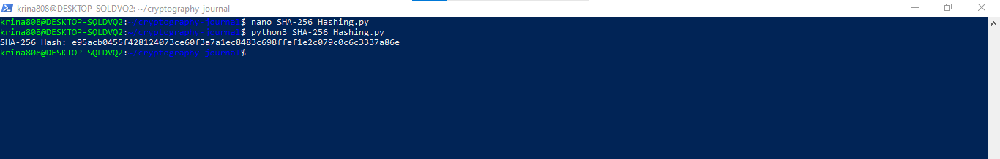
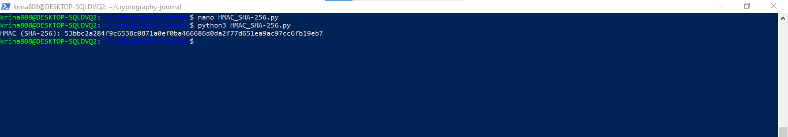

## Week 08 Journal Activity
## Algorithms Used

-SHA-256:  A secure cryptographic hash function which produces a 256 bit hash value. Very frequently used in blockchain, digital signatures and data integrity checks.

-HMAC (Hash-based Message Authentication Code):  It authenticates messages using a secret key and an available hash function (SHA-256, etc) to ensure data integrity.

## Python Code for Simulation
# SHA-256 Hashing

running: nano SHA-256_Hashing.py

In other words, SHA-256 produces a fixed 64 characters in length hexadecimal hash which verifies data integrity. The avalanche effect guarantees that even a little change in input will yield a completely different hash output..

# HMAC using SHA-256

running: nano HMAC_SHA-256.py

This provides data authentication that, if data is changed and the correct key is formed, an HMAC will be different. Data security during client server communication is provided by it and is resistant to attacks like replay attack.

# Illustrating Attacks on Systems
As one example of an attack on cryptographic systems, the birthday attack on hash functions like SHA-256 is a nice illustration of what typically needs to happen. It takes advantage of the birthday paradox, which is that the likelihood of two random inputs hashing to the same value goes up with the number of entries. The strength of SHA-256 suffers resistance to such attacks, as its hash space is large, whereas smaller or weak hash functions are at risk. The attack succeeds based on that weaknesses in hashing algorithm or implementation flaws, and is thwarted by using the sufficiently strong hash functions like SHA-256 and cryptocurrencies adopted cryptographic protocols.

# Explanations of Difficulties
Grasping the incrustations of how SHA-256 and HMAC are combined using secret keys to hash data from messages for message authentication was one of the parts that I found hard to understand of cryptographic systems like HMAC. On the initial thought of securing how you can manage these keys and how they interact with the hash function when verifying these things, the first thing it was hard to conceptualize was how a HMAC fits in bigger security protocols like TLS. Real world applications of these systems such as ensuring data integrity when transmitted were complex, but became more apparent in the practical simualtions.

# Links to and Short Summaries of Websites/Papers/Software on Security Systems and Their Attacks

1. OWASP - Hash Function Security:

link: https://owasp.org/www-project-top-ten/

It details common cryptographic vulnerabilities, hash function selection common security practices and protection from such attacks as hash collisions.

2. The Birthday Attack and SHA-256:

Link: https://www.schneier.com/blog/archives/2011/06/the_life_cycle.html 

In this article by Bruce Schneier, he explains how hash function’s properties make birthday attacks and how SHA-256 is resistant but it must be rigorously and accurately applied.

## Insights and Reflections
-With robust security for the data integrity, it allows any small change in an input to create a very different hash output (avalanche effect).

-Depending on the protocol application, HMAC helps provide some protection by adding a layer of security through a secret key - which is used to make secure communication protocols like TLS and SSL secure.

-SHA256 is resistant to collisions but computationally expensive, used in real life, it has to be chosen algorithm based case by case.
