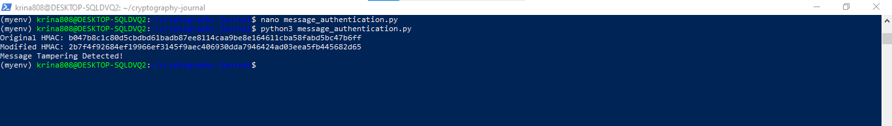
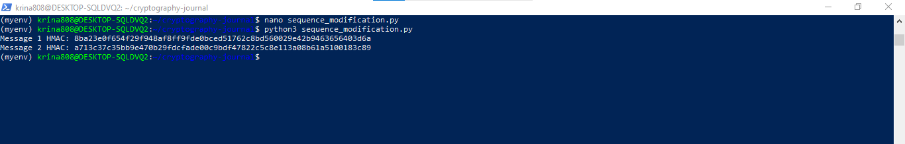
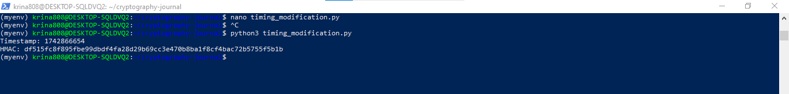
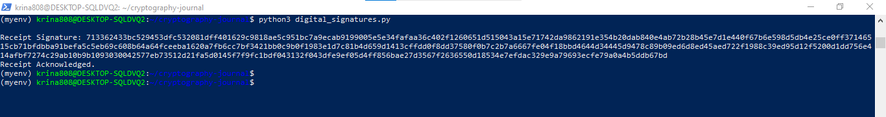

## Week 09 Journal Activity

# Goal 
This week’s activities were to explore different cryptographic techniques for data encryptions, message authentications and data integrity.

# Algorithms Used
The actual activities made use of many algorithms for different cryptographic tasks. For confidentiality, the data was encrypted in AES in CBC mode and the symmetric key was used for both encryption and decryption. Asymmetric algorithm called RSA encryption was used for securing the data transmission between the public and the private key pairs. Messages were authenticated, data tampered with and the integrity verified using HMAC with SHA-256. Also, they applied digital signatures in order to prove being non repudiables, making it possible to ensure ‘non repudiation’, that is data origin proof. Specific aspects of data communication were secured using each algorithm and the algorithm was carefully chosen based on the accommodated strengths.

# ✅ 1. Disclosure (Encryption)
# AES Encryption using PyCryptodome
Python execution: nano aes_encryption.py

from Crypto.Cipher import AES

from Crypto.Random import get_random_bytes

# Generate random key and IV

key = get_random_bytes(16)

iv = get_random_bytes(16)

# Encrypt the message

cipher = AES.new(key, AES.MODE_CBC, iv)

message = b"Confidential Data"

# Padding for AES block size (16 bytes)

pad_length = 16 - len(message) % 16

message += bytes([pad_length]) * pad_length

ciphertext = cipher.encrypt(message)

print("Encrypted Data:", ciphertext.hex())

print("Key:", key.hex())

print("IV:", iv.hex())

# ✅ 2. Traffic Analysis (Encryption)
running: nano rsa_encryption2.py

from Crypto.PublicKey import RSA

from Crypto.Cipher import PKCS1_OAEP

# Generate RSA key pair

key = RSA.generate(2048)

cipher_rsa = PKCS1_OAEP.new(key)

# Encrypt the message

message = b"Prevent traffic analysis"

ciphertext = cipher_rsa.encrypt(message)

print("Encrypted Traffic Data:", ciphertext.hex())

# ✅ 3. Masquerade (Message Authentication)

running: nano HMAC.py

import hmac

import hashlib

key = b"secure_key"

message = b"Authenticate this message"

# Generate HMAC

hmac_object = hmac.new(key, message, hashlib.sha256)

print("Generated HMAC:", hmac_object.hexdigest())

# ✅ 4. Content Modification (Message Authentication)
running: nano message_authentication.py

import hmac

import hashlib

# Original message and key

message = b"Valid data"

modified_message = b"Invalid data"

key = b"secure_key"

# Compute HMAC for both messages

hmac_original = hmac.new(key, message, hashlib.sha256).hexdigest()

hmac_modified = hmac.new(key, modified_message, hashlib.sha256).hexdigest()

print("Original HMAC:", hmac_original)

print("Modified HMAC:", hmac_modified)

print("Message Tampering Detected!" if hmac_original != hmac_modified else "Message Verified.")

# ✅ 5. Sequence Modification (Message Authentication)
running: nano sequence_modification.py

import hmac

import hashlib

# Message with sequence ID

messages = [(1, b"Message One"), (2, b"Message Two")]

key = b"secure_key"

# Generate HMAC for each message

for msg_id, msg in messages:

    data = str(msg_id).encode() + msg
  
    hmac_object = hmac.new(key, data, hashlib.sha256)
    
    print(f"Message {msg_id} HMAC:", hmac_object.hexdigest())

  

# ✅ 6. Timing Modification (Message Authentication)
runing: nano timing_modification.py

import time

import hmac

import hashlib

key = b"secure_key"

timestamp = str(int(time.time())).encode()  # Current time

message = b"Time-sensitive data"

data = timestamp + message

# Generate HMAC

hmac_object = hmac.new(key, data, hashlib.sha256)

print("Timestamp:", timestamp.decode())

print("HMAC:", hmac_object.hexdigest())

 

# ✅ 7. Destination Repudiation (Digital Signatures)

running: nano digital_signatures.py

 

# Observations
 There were various algorithms that were implemented to encrypt data, message authentication such as AES, RSA and HMAC through digital signatures to prevent modification of sequence and content, and to prevent repudiation. These cryptographic methods were all practical used in each exercise.

# Illustrating Attacks on Systems
A Man-in-the-Middle (MitM) attack is but one example of a common attack on systems that rely on cryptography, namely one where the attacker tries to either intercept or alter communications between two parties. Attacks can be performed if encryption like RSA is not applied correctly (missing proper key exchange mechanisms), whereby attackers position themselves between sender and receiver and capture, or modify, messages. The reason why MitM attacks fail against the systems where strong encryption (like RSA with secure key exchange) and authentication (like HMAC) are used is that it prevents unauthorized interception or modification of messages.

# Explanations of Difficulties
An issue I had when trying to grasp the correlation between various cryptographic systems, especially encryption and authentication, was to figure out how the asymmetric and symmetric encryption methods (RSA and AES) cooperate with each other. In particular, then, the initial confusion was over exchanging AES keys securely during a communication session using RSA. But when I realized that both RSA secures the key exchange and that AES is a very good tweezers for encrypting actual data, the combination of these two algorithms (or instead taking advantage of other encryption schemes which exist in the real world) made sense in the context of real life security.
 
# Links to and Short Summaries of Websites/Papers/Software on Security Systems and Their Attacks

1. OWASP Cryptographic Best Practices:

Link: https://owasp.org/www-project-top-ten/

Both the selection of encryption algorithms as well as key management best practices (see relatedOWASP guidelines on crypto usage from OWASP team including how to use cryptography safely, selection of encryption algorithms and key management best practices to avoid vulnerabilities like for example DES outdated algorithms).

2. Understanding RSA Encryption:

link: https://www.tutorialspoint.com/cryptography/rsa_algorithm.htm

This resource details RSA encryption by explaining how public and private keys are created, and by giving an explanation to how data is encrypted and decrypted, which is important to understand the role that RSA plays in secure communication.

# Insights and Reflections
Through these activities, I have become well versed with how cryptography is used to ensure the Security of digital communication. The AES exercise showed the significance of the symmetric key management and the RSA exercise also demonstrated the benefits of asymmetric encryption for the secure key exchange. HMAC also proved to be a good mechanism for detecting content manipulation and sequence modification. Apart from that, the fact of digital signatures was implemented to reinforce that operational paradigm of non-repudiation of accountability in the message exchanges. In general, these exercises should demonstrate the need to pick adequate cryptographic algorithms to satisfy particular security needs.
