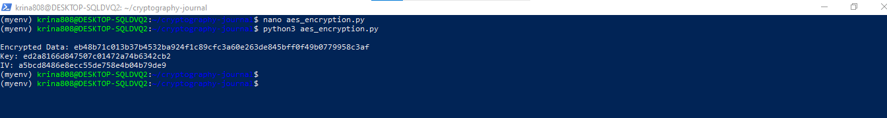
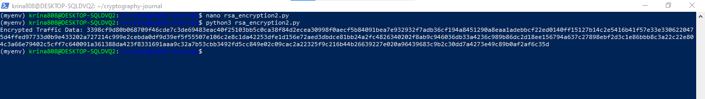
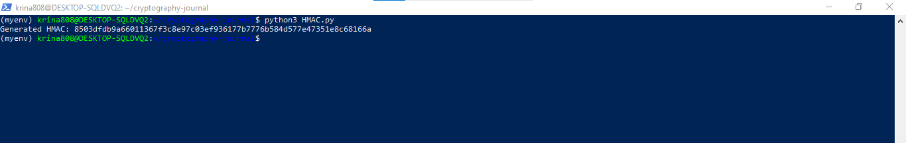

## Week 09 Journal Activity
# ✅ 1. Disclosure (Encryption)
# AES Encryption using PyCryptodome
Python execution: nano aes_encryption.py

from Crypto.Cipher import AES

from Crypto.Random import get_random_bytes

# Generate random key and IV

key = get_random_bytes(16)

iv = get_random_bytes(16)

# Encrypt the message

cipher = AES.new(key, AES.MODE_CBC, iv)

message = b"Confidential Data"

# Padding for AES block size (16 bytes)

pad_length = 16 - len(message) % 16

message += bytes([pad_length]) * pad_length

ciphertext = cipher.encrypt(message)

print("Encrypted Data:", ciphertext.hex())

print("Key:", key.hex())

print("IV:", iv.hex())

# ✅ 2. Traffic Analysis (Encryption)
running: nano rsa_encryption2.py

from Crypto.PublicKey import RSA

from Crypto.Cipher import PKCS1_OAEP

# Generate RSA key pair

key = RSA.generate(2048)

cipher_rsa = PKCS1_OAEP.new(key)

# Encrypt the message

message = b"Prevent traffic analysis"

ciphertext = cipher_rsa.encrypt(message)

print("Encrypted Traffic Data:", ciphertext.hex())

# ✅ 3. Masquerade (Message Authentication)

running: nano HMAC.py

import hmac

import hashlib

key = b"secure_key"

message = b"Authenticate this message"

# Generate HMAC

hmac_object = hmac.new(key, message, hashlib.sha256)

print("Generated HMAC:", hmac_object.hexdigest())

# ✅ 4. Content Modification (Message Authentication)

